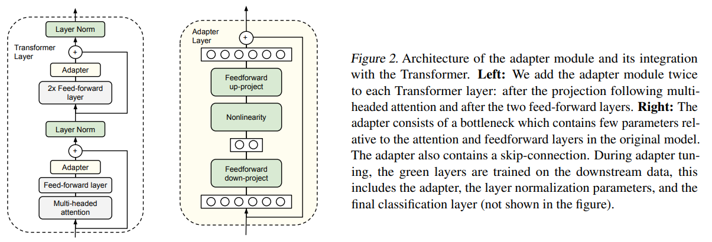
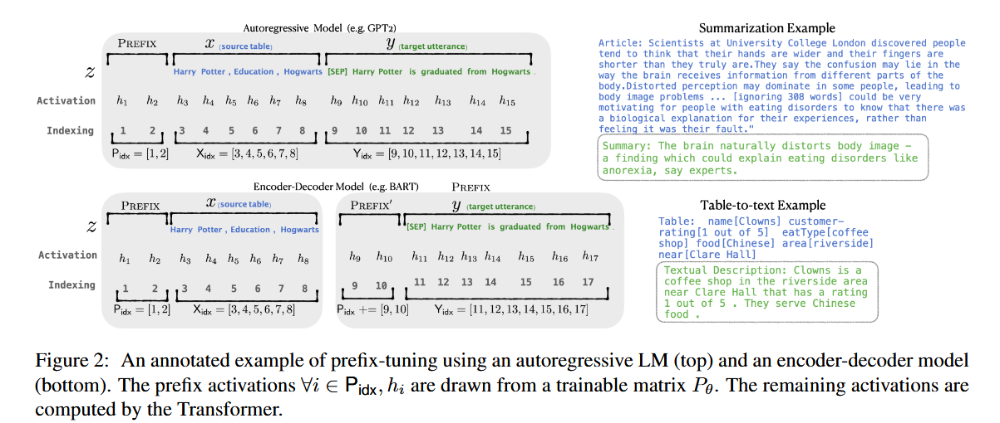
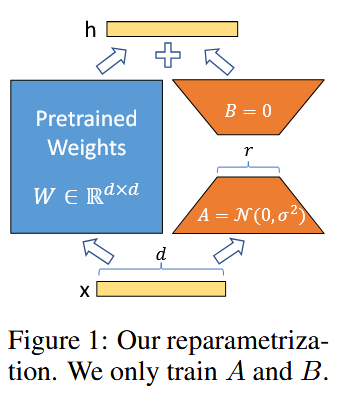

## 基础知识

### 理论

1. SFT 是什么？
   Supervised Fine-Tuning = 监督微调
    给模型看很多"输入 → 标准输出"：
	    用户：1+1等于几？
		助手：2
	
	然后让模型学会：
    看到 user 问题后，输出答案。
   这是 目标，不是具体实现方式。
2. Fine tuning 和 Lora 的关系是什么？

![[Fine tuning 和 LoRA 关系]](附件/Pasted-image-20260703213213.png)

3. Adapter tuning 是什么？



 (1) Adapter tuning 主要思想
     target = 原参数 + 新增参数 
 (2) Adapter tuning 缺点
     transformer 结构发生变化，层数加深，训练和推理时间增加
4. Prefix tuning 是什么？



 (1) Prefix tuning 主要思想
    输入新增 γ 个 prefix，γ 可变
 (2) Prefix tuning 缺点
    占用输入 prompt 长度
5. LoRA 是什么？
	LoRA = Low-Rank Adaptation
	大模型参数太多，全量训练很贵。  
	LoRA 的做法是：
		原模型权重：冻结
		额外加一小层 adapter：训练
	像给大模型贴一张 小补丁，只训练补丁。
	可用工具：
	任务：SFT
	方法：LoRA
	工具：PEFT 实现 LoRA，TRL 实现 SFTTrainer



核心思想： SVD 奇异值分解（压缩重复参数）

### 代码

[[HW7 LLM FT+RL.ipynb]]
[[ml2026hw5_finetuning_without_forgeting.ipynb]]

```python
# 核心

from peft import PeftModel  
from peft import LoraConfig, get_peft_model, prepare_model_for_int8_training, set_peft_model_state_dict  
  
  
model = AutoModelForCausalLM.from_pretrained(  
"bigcode/starcoder",  
use_auth_token=True,  
device_map={"": Accelerator().process_index},  
)  
  
  
# lora hyperparameters  
lora_config = LoraConfig(r=8,target_modules = ["c_proj", "c_attn", "q_attn"])  
  
  
model = get_peft_model(model, lora_config)  
training_args = TrainingArguments(  
...  
)  
  
trainer = Trainer(model=model, args=training_args,  
train_dataset=train_data, eval_dataset=val_data)  
  
print("Training...")  
trainer.train()  
  
# plugging the adapter into basemodel back  
model = PeftModel.from_pretrained("bigcode/starcoder", peft_model_path)
```

## 面试相关

**LoRA 高频面试 TOP 10 题**

1. 什么是 LoRA？它的核心思想是什么？

**LoRA（Low-Rank Adaptation）** 是一种轻量化大模型微调技术。其核心思想是：**冻结预训练模型的原始权重，通过引入两个低秩矩阵来模拟参数的更新量**。

数学表达为：**W' = W + ΔW = W + B × A**，其中 **A** 为降维矩阵，**B** 为升维矩阵，秩 **r** 远小于原始矩阵维度。训练时只更新 A 和 B，推理时可将 BA 合并回原权重，**不引入额外推理延迟**。

ΔW=α/r * ​BA

1. LoRA 为什么能大幅降低显存？

**冻结原始参数 W**，训练时无需存储其梯度与优化器状态（如 Adam 的动量和方差）。
实际上：
训练显存包括

- 参数
- 梯度
- Adam一阶矩
- Adam二阶矩
- Activation

如果只讨论参数部分：
FP16训练：
参数

> 2 Bytes

梯度

> 2 Bytes

Adam m

> 4 Bytes

Adam v

> 4 Bytes

合计：

> **12 Bytes/Parameter**

即

> **约6倍参数显存**

如果算master weight（FP32）甚至更高。

---

另外：

> 7B模型LoRA只需10~15GB

这也不严谨。

实际上依赖：

- batch size
- sequence length
- gradient checkpoint
- FlashAttention

例如：

Llama2-7B

LoRA：

通常

> **14~20GB**

QLoRA：

通常

> **6~10GB**

因此不能写死。

1. LoRA 的两个矩阵如何初始化？为什么？

- **矩阵 A**：采用**高斯分布随机初始化**。
- **矩阵 B**：**初始化为全 0** 矩阵。

1. 如何选择 LoRA 的秩（Rank）？

**秩 r** 决定了低秩矩阵的“自由度”：

- **r 越大**：参数量越多，表达能力越强，但显存和计算开销增加。
- **r 越小**：参数量少，效率高，但可能欠拟合。

常见取值范围为 **4～64**。复杂任务用较高秩，简单任务用较低秩。也可通过实验调优确定最佳值。**AdaLoRA** 可根据层的重要性动态分配秩。

1. LoRA 应该作用于 Transformer 的哪些模块？

建议将 LoRA 应用于**多种注意力权重矩阵**，而非单一矩阵。常见配置包括：

```
target_modules = ["q_proj", "k_proj", "v_proj", "o_proj", "gate_proj", "up_proj", "down_proj"]
```

原论文实验表明，在相同参数预算下，同时适配 Wq 和 Wv 效果最佳；单独适配 Wq 或 Wk 效果较差。现代实践常扩展到 q/k/v/o 及 FFN 全部 Linear 层。

1. LoRA 与全参数微调（Full Fine-Tuning）的差异？


| 维度       | 全参数微调       | LoRA               |
| -------- | ----------- | ------------------ |
| **更新参数** | 全部模型参数      | 仅低秩矩阵 A、B          |
| **显存占用** | 极高（参数×2～3倍） | 极低                 |
| **训练速度** | 慢           | 快                  |
| **最终效果** | 上限更高        | 在许多任务上接近甚至达到全量微调效果 |
| **适用场景** | 算力充足、任务差异大  | 资源受限、快速迭代、多任务切换    |


1. LoRA 有哪些优缺点？

**优点**：

- 参数效率高，显存占用低
- 训练速度快，成本低
- 推理无额外延迟（可合并权重）
- 支持多任务快速切换（插拔式 LoRA 模块）
- 检查点小

**缺点**：

- 数据充足、算力充足时，全量微调效果更优

1. LoRA 的关键超参数有哪些？如何设置？

- **秩（Rank, r）**：控制参数量与表达能力，通常 **4～64**。
- **缩放系数（Alpha, α）**：控制 LoRA 更新的影响幅度，通常与 r 配合。
- **Dropout**：防止过拟合。
- **学习率（LR）**：PEFT 通常用 **5e-4～1e-3**，高于全量微调。
- **Target Modules**：指定应用 LoRA 的模块。

1. 如何在已有 LoRA 模型上继续训练？

原文：

> 先merge，再训练新LoRA。

**不是必须。**

实际上有三种方案：

① Merge后继续训练

可以。

---

② 直接加载已有LoRA继续训练

PEFT官方支持。

这是目前最常见。

---

③ 多Adapter训练

多个LoRA并存。

例如：

```
adapter1
adapter2
adapter3
```

因此：

> 必须merge

## **Reference**

- [知乎：LoRA 相关文章 1](https://zhuanlan.zhihu.com/p/646831196)
- [知乎：LoRA 相关文章 2](https://zhuanlan.zhihu.com/p/654897296)
- [Microsoft LoRA (GitHub)](https://github.com/microsoft/LoRA)
- [LoRA: Low-Rank Adaptation from the First Principle (Medium)](https://medium.com/@Shrishml/lora-low-rank-adaptation-from-the-first-principle-7e1adec71541)

